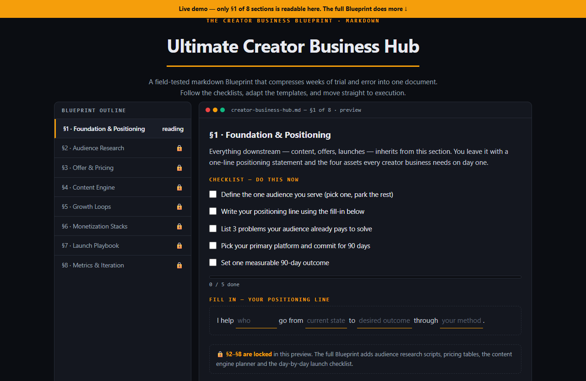

# Ultimate Creator Business Hub — live demo

  

  <a href="https://amos-mig.github.io/ultimate-creator-business-hub-demo/"><strong>▶ Open the live demo</strong></a> ·
  <a href="https://amosmign.gumroad.com/l/ultimate-creator-business-hub"><strong>Get the full product · €7</strong></a>

## What this is

An interactive preview of the Ultimate Creator Business Hub markdown Blueprint: Section 1 is fully readable with a working progress-tracking checklist and a fill-in positioning statement, while sections 2–8 sit behind locked rows. A client-side readiness quiz scores five business signals and points you to the section that fixes your weakest one.

**Try it:** Tick items in the §1 checklist, fill in the positioning line, hit 'Score my readiness', then click any locked section row.

## What you get in the full product

- Step-by-step structure — know exactly what to do next
- Checklists and tables you can fill in and reuse
- Written from real-world practice, not theory
- Instant digital download — read it in any markdown viewer or Notion

## About

- **Storefront:** [kits.amosmignery.dev](https://kits.amosmignery.dev) — single-file products, instant download, commercial license
- **Checkout:** [Gumroad](https://amosmign.gumroad.com/l/ultimate-creator-business-hub) (Merchant of Record, VAT handled)
- **Full product:** [Ultimate Creator Business Hub](https://amosmign.gumroad.com/l/ultimate-creator-business-hub) · €7

## License

The demo page in this repo is MIT-licensed — reuse the technique, not the product.
The **Ultimate Creator Business Hub** itself is not included here and is not free software.
